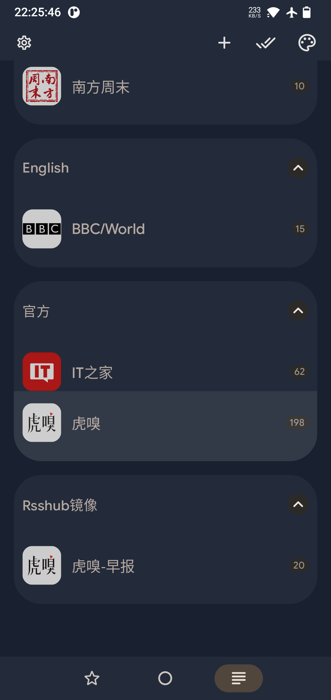
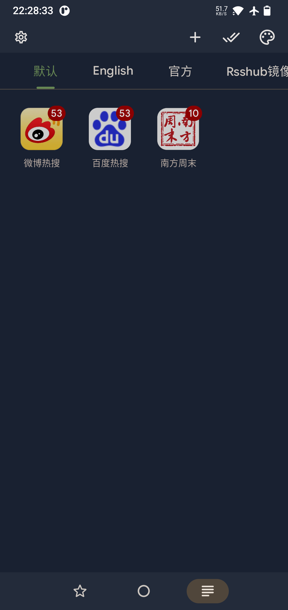
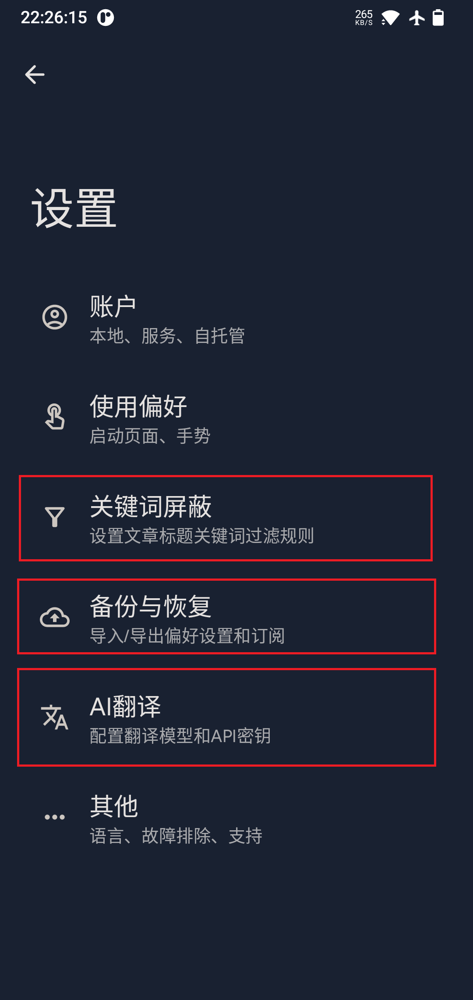
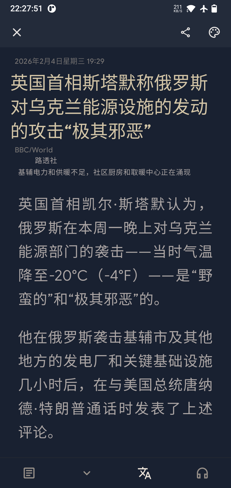
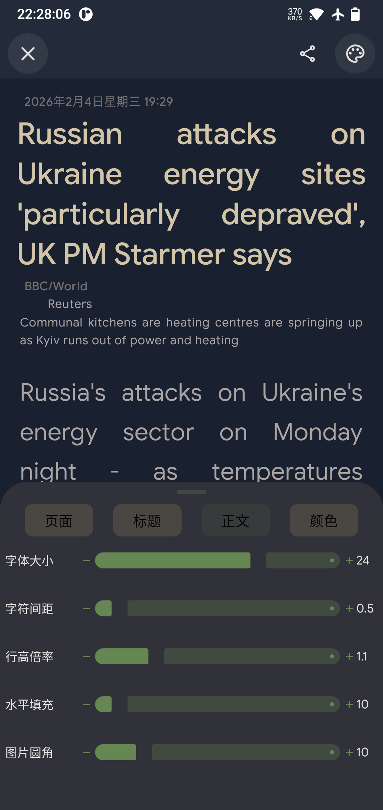
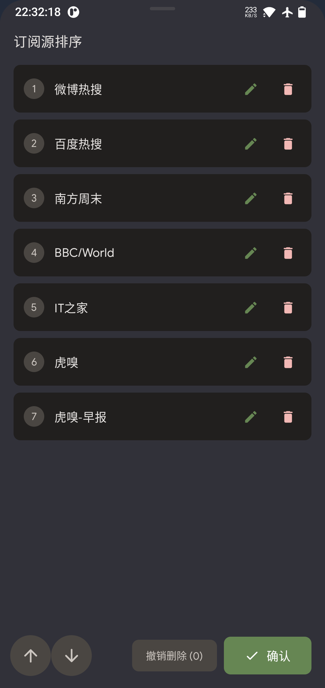
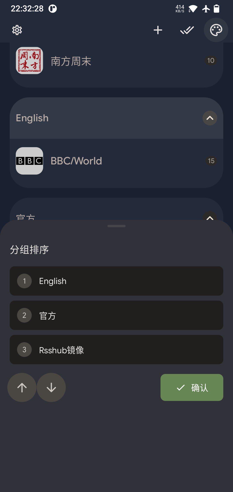

## 此修改版特点

- ui界面 某些设置仅支持中文。
- AI翻译功能仅支持：英->中
- 修改代码主要由AI生成，本人基本没review，再加上改的比较随意就不提PR了。

## 吐槽

找遍开源Android rss 阅读器，竟然找不到一款能够完全随心所欲对文字颜色排版设置的，也没找到一款能调节文字颜色的。

能入眼的也就这几款（ReadYou Feeder 还有个界面不错的忘了名字）。

都试了一遍也就本软件功能上不错。

**真羡慕那些眼睛好的人，那么小的字 又或那么高的对比度，长时间阅读眼神还是那么好，真是佩服。**

为了我的眼睛，只能自己改了，幸好最近ai能力起来了，就花了点时间让ai改了下。

由于工作用不上ai，只能找找免费的用用。

不得不说：**国产AI任重道远，虽然便宜免费，但在编程方面用起来真是难受，谁用谁知道，特别是这种Android项目。**

## 修改与新增功能：

---

---

---

## Build

- fork 然后 使用 git action
- 本地编译

### Special Thanks

这是源仓库：https://github.com/ReadYouApp/ReadYou

## License

GNU GPL v3.0 © [Read You](https://github.com/ReadYouApp/ReadYou/blob/main/LICENSE)
